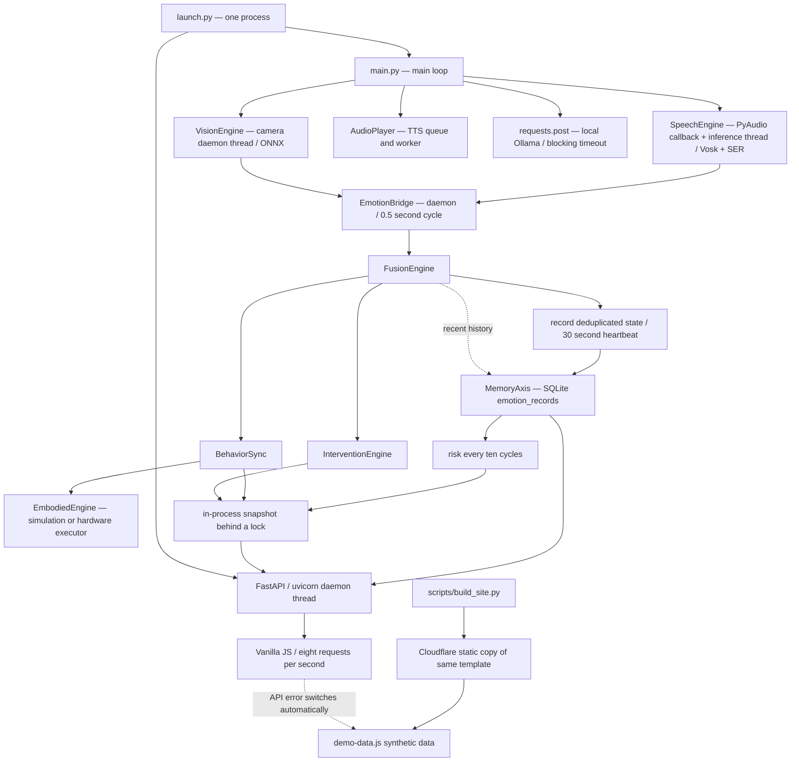

# Product baseline audit — 2026-10-02

## Phase 0: LOCAL_REMOTE_AUDIT

```text
current_branch: master
local_head_before_sync: 354abd7ef29c18ca5ad9695869a879983e70ae54
origin_master: 09a9fe0cd455a810a04c48ac7226e4989266ee75
ahead: 0
behind: 1
modified: none
staged: none
untracked: none
local_only_commits: none
remote_only_commits: 09a9fe0 Improve runtime reliability, engineering documentation and automated checks
conclusion: clean checkout; fast-forwarded to verified origin/master; no user changes discarded
```

The eight file differences before sync were changes in the remote commit, not local edits.
No push or commit is authorized by this delivery request. No AGENTS.md was found in the repository.

## Phase 1: actual architecture before changes



The actual order is fusion → recording → behavior → embodied execution → intervention → risk → snapshot.
There is no separate application service layer. `web/api.py` owns a global bridge and lazily creates
independent MemoryAxis/Fusion/Behavior/Embodied/Intervention instances without a bridge. It can therefore
serve a default neutral state even when there is no running sensor pipeline. Standalone API and integrated
launcher are different lifecycles. Bridge state is process-local: multiple uvicorn workers cannot share it.

SQLite is a shared file; each operation opens a connection, but transaction context managers do not close it.
`core/memory.py` has a legacy `logs` table; `reports/report_generator.py` can read either schema.
`web_ui.py` is a legacy Streamlit robot entry. `streamlit_dashboard.py` is a separate synthetic demonstration.
`emotion/cloud_sync.py` is optional legacy file/HTTP synchronization, not wired into the launcher path.

Models load in sensor constructors. CI imports software emotion modules and lightweight FastAPI;
it does not prove any real camera, microphone, model or actuator is operational. The hardware flag only
selects an executor; it is not a successful device probe. Web liveness does not imply readiness.

## Product gap register

P0: data security, correctness or delivery blockers. P1: missing core product functions.
P2: reliability/performance/maintenance. P3: usability and documentation.

| Priority | Evidence at baseline | Required change |
| --- | --- | --- |
| P0 | web/app.py accepts any bind host; all history including source_text is unauthenticated | Enforce local-only host, client and browser-origin boundary; forbid public/tunnel deployment |
| P0 | readme.md recommends localtunnel while DEPLOY.md forbids real-data exposure | Replace conflicting remote instructions with explicit local product scope |
| P0 | app.js action and report lists interpolate backend strings into innerHTML | Use DOM elements and textContent; test hostile strings |
| P0 | app.js defaults demoFallback=true; network/HTTP/JSON error permanently enters synthetic mode | Only explicit user/config DEMO; disconnected and error states stay visible |
| P0 | launch --no-robot still creates dummy bridge against real DB | Dashboard-only must not record synthetic states; DEMO must be separate and explicit |
| P0 | intervention.generate_parent_report(days) always computes weekly trend | Match the requested report interval and test old-record exclusion |
| P0 | build_site.py recursively deletes arbitrary --out | Constrain output and verify resolved paths before replacing generated artifacts |
| P1 | No v1 response schemas, uniform errors or request ID | Add typed product routers/service, preserve legacy GET compatibility |
| P1 | No history date filter/pagination UI, device panel or settings/privacy view | Add complete single-source frontend product flow |
| P1 | system status hardcodes all modules true | Probe DB/bridge/devices/models/Ollama; expose healthy/degraded/unavailable/disabled/unknown |
| P1 | No migration/retention/export/delete/backup operation | Keep SQLite; add schema version, closed connections and explicit maintenance controls |
| P1 | No reproducible complete deployment or acceptance script | Verify native lightweight installation/startup and persistent storage; optional Docker recipe |
| P2 | refreshAll calls 8 APIs every second including report and three trend queries | One realtime snapshot at 1 Hz; history >=30 seconds and reports >=60 seconds/manual |
| P2 | setInterval starts new requests before previous completion | In-flight guard, bounded timeout, retry after recovery and cancel stale mode changes |
| P2 | speech get clears the same state peek reads | Independent latest-event view and consuming cursor |
| P2 | risk list is reset on nine out of ten bridge cycles | Retain risk until the next risk evaluation |
| P2 | SQLite with connect commits/rolls back but leaves handles open | Explicit closing context with busy timeout/foreign_keys per connection |
| P2 | async API handlers perform synchronous DB/report work | Run product endpoints in worker threads and keep heavy work out of realtime |
| P2 | port/timeout parse at import can fail opaquely | Named configuration errors and range validation with CLI messages |
| P2 | model/device/inference exceptions or queue failures are hidden | Bounded queues, rate-limited module logging, status and idempotent shutdown |
| P2 | Ollama handles only successful HTTP; missing fallback and malformed/empty response handling | Bounded local request, deterministic fallback, health probe, shutdown gate |
| P2 | launch uses daemon uvicorn.run without controllable shutdown | Uvicorn Server with should_exit and joined lifecycle |
| P2 | CI only pytest; no browser/frontend/lint/dependency checks | Lightweight separate software checks, no model downloads |
| P3 | loading/offline/empty/keyboard/chart semantics inconsistent | Clear state labels, navigation buttons, chart text/table alternatives and responsive layout |
| P3 | environment example incomplete, model tags/doc commands inconsistent | Single configuration table and current quick-start/deployment/troubleshooting |

### Refresh cost

One successful baseline refresh sends exactly 8 HTTP requests: current emotion, behavior command,
parent report, risk triggers, system status, trend, valence series, category counts. This is 480 requests
per minute per open browser. A parent report executes several historical scans, with another independent
risk query; the historical chart also separately queries trend/series/counts. Report generation and database
reads run synchronously inside async handlers. Slow responses accumulate new rounds and browser network
traffic. No CPU benchmark was performed, so an exact CPU percentage cannot be claimed.

### Backend/security/data boundary decisions

Deliver a local-only single-user, single-child edge product. The computer's logged-in operator is the
administrator; this release does not offer remote parent accounts, multi-user authorization or multi-tenant
isolation. Do not invent owner IDs implying such support. A later remote version must add established
password hashing, HttpOnly cookie sessions, logout, authorization, CSRF, HTTPS and ownership migration
before exposing real data. CORS is never authentication. No public mode override is included.

All real-data endpoints, legacy routes and docs receive the same boundary. No writable HTTP endpoint is
needed for the first local release: backup/export/retention/deletion are explicit local administrative commands.
Raw child speech is not logged; request errors expose generic messages and a request ID. Database and
exports remain private local files and must not enter source control. Demo has no real-data storage writes.

Keep FusionEngine/BehaviorSync/Intervention thresholds and emotion rules intact. Correct report interval
selection and bridge event/lifecycle bugs without changing algorithm values. Keep SQLite and meaningful
small service/router/contracts modules; SQLAlchemy/Alembic are not required for this single-file edge scope.
Keep Vanilla JS because a four-panel same-origin application can meet the requirements without a second
partially migrated React UI. Keep REST snapshot because 1 Hz does not require a WebSocket dependency.

### Baseline validation

Python default interpreter lacks FastAPI. Existing `.venv-test` contains the web/test dependencies.
Using that environment and a writable unique temporary directory: **163 tests passed**.
`node scripts/verify_demo.js`: **44 assertions passed** (synthetic engine only).
There is no Docker executable on this machine. CI cannot be certified green without pushing; no push is requested.

## Implementation phases and ownership

| Phase | Goal | Main files | Gate |
| --- | --- | --- | --- |
| 2 | P0 security/correctness | config.py, web/security.py, web/api.py, web/app.py, launch.py, bridge/speech, memory_axis/intervention, app.js, build_site.py, README | Full pytest + DOM/DEMO regression |
| 3 | Typed backend product layer | web/contracts.py, web/product.py, web/service.py, API integration | Snapshot/history/report/errors integration |
| 4 | Frontend product flow | app.js, dashboard.html, style.css, frontend tests | REAL/DEMO/OFFLINE/ERROR/empty/XSS |
| 5 | Realtime/data separation | dashboard service and frontend scheduler | No history/report query on snapshot; no overlapping refresh |
| 6 | Local data boundary and maintenance | database module/CLI, config and docs | Export/backup/restart/delete/retention/permissions |
| 7 | Observable edge lifecycle | modules/, main.py, launch.py, bridge, hardware smoke | Fake adapters/failure states, bounded shutdown |
| 8 | Tests and CI | tests/, scripts/, package.json, workflows, requirements | Full Python + Node + browser smoke + lint |
| 9 | Reproducible deployment | Dockerfile, compose, scripts, DEPLOY.md | Actual native install/start/persistence; Docker limitation explicit |
| 10 | Handoff documentation | README, DEPLOY, docs | Commands/config/known limitations consistent |
| 11 | Acceptance and delivery | docs/PRODUCT_DELIVERY_REPORT.md, saved diff | Evidence checklist; no false hardware/CI claims |
