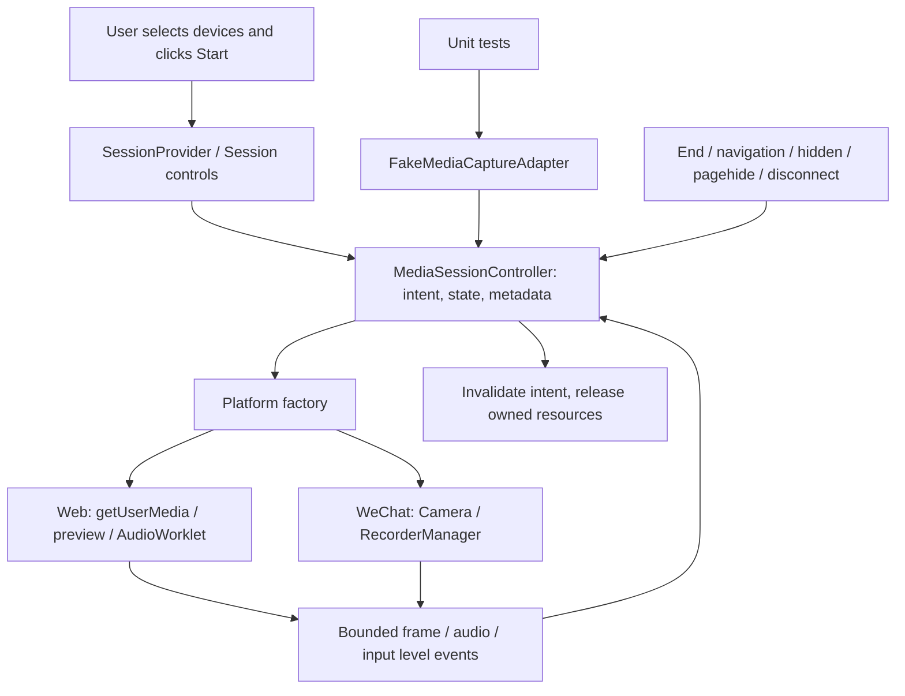

# Phase 03 — Device media capture

Implementation validated: 2026-10-03; delivery follow-up: 2026-10-04 (Asia/Shanghai). Branch: `03-device-media-capture`.
Parent: `a34f02d03da1ddbda0440584065056fd1f327567` on `02-cross-platform-ui`.

## PHASE03_EXISTING_WORK_AUDIT

The owner's latest Phase03 request was read before further implementation. The full working diff, staged diff, ten-commit log, untracked inventory and remote branch heads were inspected. No reset, clean, restore, project regeneration or force push was used.

| Field | Existing state at the audit |
| --- | --- |
| current_branch | `03-device-media-capture` |
| head | `a34f02d03da1ddbda0440584065056fd1f327567` |
| parent_phase02 | Same SHA, verified on `origin/02-cross-platform-ui` |
| modified | 7 tracked files: checks workflow, app, styles, Home, Session, Settings, root package scripts |
| staged | None |
| untracked | 23 source/test/document files; all retained |
| remote_phase03 | No remote Phase03 head returned; no existing remote branch overwritten |
| existing_media_files | Types, controller, Web/Fake/Android adapters, base/platform factory, H5 preview, image/WAV/worklet processors |
| existing_tests | Media controller, bounded processors, readable media status helpers |
| existing_ui_changes | SessionProvider, explicit modality choices, Start/Stop, permission states, local sample counts and clear absence of inference |
| what_is_complete | Initial interface/controller/encoding implementation; initial H5 build, typecheck, 110 client tests; 327 preserved Python tests, 38 legacy DOM checks, 44 demo checks, 8 legacy browser checks |
| what_is_partial | Web device ownership on failed cleanup; UI still tied local capture to REAL/service state; no final media browser evidence |
| what_is_missing | WeChat compile boundary, microphone input level, camera enumeration/selection, dedicated media browser runner, final H5/DEMO_ONLY checks and remote delivery |
| risks | Cleanup failure must retain owned resources for a real retry; late callbacks must not affect a new run; existing DEMO restriction conflicts with the new request; platform tests cannot establish physical-device success |

All existing source and UI work is extended in place. Per the latest request, this delivery stops after Phase03; it must not create Phase04, package Android or introduce cloud authentication/inference.

## Parent verification

The exact Phase02 commit passed all six remote Linux jobs: backend tests, lint, H5 client, legacy frontend tests, legacy frontend build, and dependency checks. The H5 job ran 61 unit tests and 14 actual browser checks and uploaded build/evidence artifact `11265524385` (2,502,609 bytes). [Run 37100236654](https://github.com/C1801SYQ/SoulCompanion-AI/actions/runs/37100236654), [H5 job](https://github.com/C1801SYQ/SoulCompanion-AI/actions/runs/37100236654/job/111138170645).

The same exact commit also has a completed/success Cloudflare Workers and Pages check, independently read through GitHub's check-runs API: check `111147283657`, deployment `e027e65c-6fd3-46f8-aa43-c9388ba668a4`. [Phase02 Pages check](https://github.com/C1801SYQ/SoulCompanion-AI/runs/111147283657). This confirms only the parent's cloud result; Phase03 has separate evidence below.

The reviewed client dependency policy still accepts 36 known findings; successful policy validation does not mean a clean security audit. Phase03 does not introduce dependencies or revise those exceptions.

## Architecture



`src/media/types.ts` defines the common contract. `MediaSessionController` owns explicit intent and immutable UI metadata, never retained raw bytes. `adapters/platform.h5.ts` and `platform.weapp.ts` select the implementation at build time; platform preview components own their DOM or Taro Camera surface. Session business pages do not call `navigator.mediaDevices`, `MediaRecorder`, `wx`, `Taro.createCameraContext` or `Taro.getRecorderManager`.

Camera and microphone are independently selectable and owned. Session phases are `idle / starting / active / stopping / error`; each device separately reports `off / requesting / on / denied / missing / error` and permission `unknown / granted / denied`. A background interruption stops the session; it does not promise a paused live stream. Preview mounting is separate from an attached camera stream. Cleanup failure keeps an error and blocks Start until a real cleanup retry succeeds.

Emotion data and local capture are independent. REAL and DEMO_ONLY builds require the same explicit Start action. Neither an unavailable emotion backend nor a synthetic emotion source prevents local capture. Switching the emotion source stops the current session and requires a fresh Start. Existing V1 observations and DEMO emotion values are never presented as inference from this capture.

## Supported environments and behavior

| Environment | Implementation | Current evidence / limit |
| --- | --- | --- |
| Desktop H5 | Native browser media APIs in a secure context | Chromium virtual devices; physical Windows devices untested |
| Mobile H5 | Same Web adapter, `muted / autoplay / playsInline`, front-facing default | Responsive browser emulation; Android and iPhone hardware untested |
| WeChat | Isolated `.weapp` adapter and Camera preview, Taro recorder API | TypeScript and SDK-shaped fake driver tests only; Phase07 owns DevTools and real-device acceptance |
| Future Android WebView | Reuse Web adapter; optional injectable lifecycle interface | Interface tests only; no Capacitor dependency, APK or native bridge in Phase03 |

**Web camera:** Start requests reasonable ideal 640×480 with `facingMode: user` or `environment`. After a camera grant, explicit refresh can enumerate usable cameras; selecting one applies its exact ID on the next Start. A running camera is not silently replaced. Stop the old session before starting with another camera. Labels/IDs stay in client memory and are never sent or persisted.

The preview uses a real HTML video element exclusively inside the H5 platform component. A reused canvas encodes JPEG at bounded quality, with signature/MIME validation; the contract also accepts bounded WebP. Sampling defaults to 2 fps, configurable 1–4 fps, maximum 640×480 and 200 KiB per encoded frame. There is one encode in flight, no growing frame queue, and no encoding without video subscribers. Old-epoch encode completion cannot publish a frame or clear a newer encode's ownership.

**Web microphone:** Start creates/resumes a Web Audio context during the user action and requests a separate audio stream. A static AudioWorklet collects mono PCM at the actual sample rate. Default chunks are 1000 ms; allowed configuration is 500–2000 ms and at most 128 KiB including the WAV header. One pending transferable packet and one fixed accumulation buffer bound the pipeline. Overflow stops capture instead of accumulating a queue. Audio unsubscribing skips WAV encoding, while buffers are cleared and acknowledgements still complete. RMS is computed from actual PCM, normalized to 0–1, and displayed as input strength. An unknown measurement is `null`; sound amplitude is not emotion, transcription or an AI reply.

**WeChat:** Camera frame callbacks provide RGBA input; a bounded canvas produces JPEG through the platform's temporary-file interface. RecorderManager is a singleton with a stable dispatcher and an owned session lease; repeated sessions do not accumulate `on*` handlers or require nonstandard `off*` APIs. The platform's MP3 fragments keep `audio/mpeg`, a parsed sample rate and an unknown duration when the SDK does not establish it. Compressed bytes are not treated as PCM or used to invent RMS. The natural recorder end stops the companion device. Pending cancellation and late `onStart` callbacks trigger another real stop and retain the recorder barrier until its terminal callback. SDK-created temporary files are deleted; failed deletion retains the owned path and causes an honest cleanup error with a subsequent real retry. These are driver tests, not verified WeChat codec/hardware behavior.

## Permissions, lifecycle and privacy

Opening pages, mounting idle preview placeholders and listing cameras before a grant do not request media permissions. Only explicit Start requests the selected devices. Camera/mic can be used separately. The first-screen Start/End controls have text and keyboard roles; device states use readable ON/OFF/REQUESTING/DENIED/UNAVAILABLE/ERROR labels. Failure messages distinguish permission refusal, missing devices, a possibly occupied device, unsupported browser and an insecure context without exposing raw device error text. Permissions recover through the browser's site settings and an explicit retry, never an automatic prompt loop.

Stop revokes pending intent synchronously, then ends owned tracks, detaches `video.srcObject`, stops sampling, clears callbacks and PCM, disconnects nodes, closes worklet ports and audio contexts, and removes per-device listeners. Controller and adapters retain references to resources whose cleanup failed, so the next End attempts actual release. Late grants and callbacks from old epochs cannot publish new samples or activate the UI. Repeated Start/Stop, failure observers and synchronous subscriber reentry have regression coverage.

Leaving Session, unmount, pagehide/refresh, hidden/background, transport offline, track end/disconnection and source changes all stop capture. Returning visible/online never starts it automatically. Browser lifecycle listeners stay available for explicit later sessions and are removed when the adapter is disposed. An emotion backend going offline alone does not gate a new local session.

See [MEDIA_PRIVACY.md](MEDIA_PRIVACY.md). Phase03 has no upload, media WebSocket, inference endpoint, media download, database writes, capture-related browser-storage writes or raw-media logs. Web media is processed in bounded transient memory. Taro's existing `jsonp-retry` dependency performs one fixed `localStorage.__store__` capability probe at module initialization and immediately removes it, before any device request. Browser evidence records that probe separately and requires zero other writes and zero writes during capture. WeChat APIs may create local temporary files, which the adapter owns and deletes; this platform exception is documented and is not described as disk-free capture. Test artifacts contain aggregate metadata and screenshots of Chromium's virtual test pattern, not recordings from physical devices.

## Validation and evidence

The final source candidate passed independent review with no unresolved findings. Full results below distinguish browser execution from fake adapters and physical devices. Earlier failed media runs remain in ignored test evidence; they are not counted as successful acceptance.

| Gate | Result |
| --- | --- |
| Client TypeScript | PASS, including isolated WeChat source |
| Client unit tests | PASS, 166 tests in 8 files: 61 preserved client tests and 105 media tests (46 controller, 46 adapter/processor, 13 status text) |
| H5 build, REAL-capable | PASS, 1745 transformed modules and emitted static AudioWorklet |
| H5 build, PUBLIC_DEMO_ONLY=true | PASS, 1745 transformed modules and emitted static AudioWorklet |
| Client five-page browser acceptance | REAL-capable PASS, 14 checks; DEMO_ONLY PASS, 3 grouped checks across all five pages |
| Native Chromium virtual-media acceptance | REAL-capable PASS, 14 checks; DEMO_ONLY PASS, the same 14 checks with zero emotion API requests throughout |
| Python baseline | 327 passed; no Python capture/model changes |
| Legacy DOM / explicit DEMO | 38 / 44 passed |
| Legacy browser acceptance | 8 passed |
| Lint / diff / dependency policy | PASS; 11 strict dependency-policy tests, 36 existing findings accepted; dependency graph and both lockfiles unchanged |

Reproduction, from the repository root (Node 24, Python 3.12):

```powershell
npm ci --ignore-scripts
npm --prefix apps/client ci --ignore-scripts
npm --prefix apps/client run typecheck
npm --prefix apps/client test
npm run client:audit
$env:PUBLIC_DEMO_ONLY='false'
npm --prefix apps/client run build:h5
npx playwright install chromium
npm run client:test:e2e
npm run client:test:media
$env:PUBLIC_DEMO_ONLY='true'
npm --prefix apps/client run build:h5
npm run client:test:e2e -- --demo-only
npm run client:test:media -- --demo-only
python -m pytest -q -p no:cacheprovider --basetemp .test-artifacts/pytest-phase03
npm test
npm run test:demo
npm run lint
git diff --check
```

Install `requirements-web.txt` and `requirements-dev.txt` in the test interpreter. A selected interpreter can be passed as `SOULCOMPANION_PYTHON`. Use `--demo-only` only against a build made with `PUBLIC_DEMO_ONLY=true`. CI installs Chromium with Linux system dependencies and runs both builds in separate jobs.

The media runner uses Chromium's `--use-fake-device-for-media-stream` and `--use-fake-ui-for-media-stream`: it exercises actual `getUserMedia`, live/ended native tracks, decoded preview, JPEG signatures, transferred AudioWorklet PCM and measured nonzero RMS. Permission refusal/missing devices use injected DOMExceptions; delayed permission uses a delay wrapper around actual virtual native streams; hidden/pagehide stimuli are injected lifecycle events. These distinctions stay in the result JSON. Fake adapter/SDK tests are reported separately.

Browser checks include zero initial permission requests, repeat sessions, cancellation of late grants, track/context release, preview detach, navigation/background/offline behavior, permission/missing UI, post-grant camera selection and capture without the emotion service. All HTTP requests are checked against actual same-origin build assets and named read-only test APIs; unexpected requests, WebSockets, downloads and persistent writes fail acceptance. Each runner owns its temporary servers, records graceful exit and verifies TCP refusal; a cleanup failure cannot produce a passed result.

Local REAL-capable evidence: `.test-artifacts/v2-client-acceptance/run-vb7fd3/results.json` and `.test-artifacts/v2-media-acceptance/run-9mbx01/results.json`. The native media run decoded a 640×480 preview, verified an 8394-byte JPEG by its actual header, and measured 32000 PCM bytes / 16000 samples at 16000 Hz with nonzero RMS 0.0687755765. Stopped tracks were `ended`, audio contexts `closed`, videos detached and counters no longer advanced. Storage evidence recorded one deleted pre-permission framework probe, zero unknown writes and zero capture writes. These values describe one virtual-device test run, not physical hardware or emotional analysis.

Local DEMO_ONLY evidence: `.test-artifacts/v2-client-acceptance/run-OxP3Qt/results.json` and `.test-artifacts/v2-media-acceptance/run-mNFf4S/results.json`. The five-page runner does not click device Start and therefore records zero media requests; the separate media runner explicitly starts actual virtual native streams and proves local capture remains available while all emotion API requests remain zero. Both media runs and all four final runner invocations recorded owned-server graceful exits and TCP refusal. Local `apps/client/dist` is ignored and is never committed.

The Pages-policy follow-up was also built with `CF_PAGES=1` and `PUBLIC_DEMO_ONLY=false`: `.test-artifacts/v2-client-acceptance/run-lYyopa/results.json` passed all 3 grouped DEMO_ONLY checks and `.test-artifacts/v2-media-acceptance/run-56taz9/results.json` passed all 14 native-media checks. This proves the effective Pages rule through the rendered build, including local capture and zero emotion API traffic; the explicit flag alone is not the tested cause. TypeScript, all 166 unit tests, lint and independent code review also passed again for the follow-up.

Responsive checks cover 375×812, 390×844, 430×932 and widths 768/1024/1440. All five pages and the active preview must avoid horizontal overflow. Start/End fit the mobile first screen; essential controls have at least 44 px targets, text/roles and keyboard operation. Existing reduced-motion behavior remains in place.

## Cloudflare and Git delivery

The owner's existing Pages project and production branch remain unchanged. Recommended Preview configuration remains root `apps/client`, build `npm ci --ignore-scripts && npm run build:h5`, output `dist`, `NODE_VERSION=24.18.0` and `PUBLIC_DEMO_ONLY=true`. No Cloudflare account settings or credentials were changed.

The original media implementation commit is `f18782094515485deb4912c284d7b77e6c6662f9`, with the requested message `feat: add cross-platform device camera and microphone capture`. Its local and remote Phase03 SHA matched. [GitHub Actions run 37121751985](https://github.com/C1801SYQ/SoulCompanion-AI/actions/runs/37121751985) completed successfully with all seven jobs; its two H5 evidence artifacts are `11273294536` (REAL-capable) and `11273850960` (DEMO_ONLY). [Cloudflare check 111199386732](https://github.com/C1801SYQ/SoulCompanion-AI/runs/111199386732) also reported a successful deployment to [immutable Preview f40526a2](https://f40526a2.soulcompanion-dashboard.pages.dev).

An additional actual browser read of that old Preview found HTTP 200, zero initial device requests, but REAL still selected and enabled, no DEMO badge and 11 blocked API attempts. A passed build alone did not establish the required public emotion-data mode. The project dashboard's effective Preview variable scope was not inspected, so its underlying misconfiguration is not claimed as proven.

Phase03 now also compiles `PUBLIC_DEMO_ONLY=true` whenever the standard Pages build marker `CF_PAGES=1` is present, even if the public flag is absent or false. Local builds without that marker keep the existing explicit REAL/DEMO behavior. [Cloudflare documents this default system marker](https://developers.cloudflare.com/pages/configuration/build-configuration/). The Preview CI job deliberately uses `CF_PAGES=1` with `PUBLIC_DEMO_ONLY=false` and requires both DEMO_ONLY browser runners to pass. Local device Start stays available and no emotion backend is added.

The follow-up build-policy commit, exact remote SHA, seven-job Actions result, new Pages deployment and actual live DEMO/zero-API browser result will be recorded after verification. The old successful deployment above is not presented as the corrected public Preview.

## PHASE 03 DELIVERY REPORT

| # | Item | Delivery |
| --- | --- | --- |
| 1 | Existing work found | See the initial audit above: 7 modified and 23 untracked files, no staged work, Phase02 parent |
| 2 | Work preserved | Extended existing controller, adapters, UI and tests in place; no reset/clean/restore/regeneration/force push |
| 3 | Architecture | Portable contract/controller, platform factory/preview, isolated Web/WeChat/Fake adapters; metadata-only UI |
| 4 | Files changed | 38 source/test/config/document files: media modules, Session provider/controls/text, Home/Session/Settings/styles, media tests, browser runners, build configuration, CI/scripts, README/privacy/delivery docs. No dependency, legacy Python hardware, model or raw-media files changed |
| 5 | Web camera | Explicit permission, native preview, front/back and post-grant device choice, bounded no-queue frame encoding |
| 6 | Web microphone | Explicit native audio, bounded mono WAV, genuine input RMS, no raw persistence |
| 7 | Session UX | Local-device Start/End, separate accurate device states, no-upload/unconnected-inference explanation; DEMO_ONLY can capture |
| 8 | Media lifecycle | Stop/navigation/background/pagehide/offline/disconnect/unmount release; late grant cleanup and no automatic resume |
| 9 | Privacy | No upload/persistent raw media; SDK-owned temporary WeChat files deleted with failure/retry ownership |
| 10 | WeChat adapter | Taro platform boundary and SDK-shaped fake tests; no DevTools/physical-device claim |
| 11 | Android path | Web reuse and injectable lifecycle contract; no APK/native bridge/dependency added |
| 12 | Unit tests | 166 passed, including 105 media/controller/processor/status tests; compile and independent review passed |
| 13 | Browser tests | REAL-capable five-page 14 + native-media 14 passed; DEMO_ONLY five-page 3 grouped + native-media 14 passed; virtual-native/injected evidence separated |
| 14 | Responsive checks | All six widths passed, including active preview and mobile first-screen Start/End with 44 px controls |
| 15 | Baseline regression | Python 327, DOM 38, DEMO 44 and legacy browser 8 passed; lint passed; legacy Python capture/model files unchanged |
| 16 | Cloudflare result | Original source build succeeded but actual Preview mode required correction; final corrected deployment verification pending below; no production-branch change |
| 17 | Commit SHA | Original media implementation `f18782094515485deb4912c284d7b77e6c6662f9`; follow-up build-policy SHA pending |
| 18 | Remote branch SHA | Original implementation SHA equality verified; final follow-up equality pending |
| 19 | Known limitations | Physical devices untested; WeChat MP3 does not provide truthful PCM input level or guaranteed fragment duration; no media inference/upload; 36 known dependency findings remain |
| 20 | Phase04 prerequisites | Await owner's next instruction; define backend provider/domain, authentication/isolation and separately reviewed media ingestion/privacy contract. No Phase04 branch or backend implementation created |

## REAL DEVICE EVIDENCE

| Device / environment | Result | Meaning |
| --- | --- | --- |
| Chromium fake camera | PASS | Both builds: native Chromium API, decoded preview, actual bounded JPEG and ended tracks; not a physical camera |
| Chromium fake microphone | PASS | Both builds: native Chromium API / AudioWorklet, nonzero PCM RMS, closed tracks/context; not a physical microphone |
| Physical Windows camera | NOT TESTED | Automated tests never access the developer's actual device |
| Physical Android browser | NOT TESTED | Responsive emulation is not Android hardware acceptance |
| Physical iPhone browser | NOT TESTED | Responsive emulation is not Safari/iPhone acceptance |
| WeChat DevTools | NOT TESTED | Taro TypeScript / SDK-shaped fake tests do not establish DevTools success |
| WeChat physical device | NOT TESTED | Requires registered AppID and later Phase07 acceptance |

## Stop condition

Finish and verify Phase03 on `03-device-media-capture`, then stop and wait for the owner. Do not create `04-cloud-backend`, merge master, change Phase01/02 history or package an Android app.
