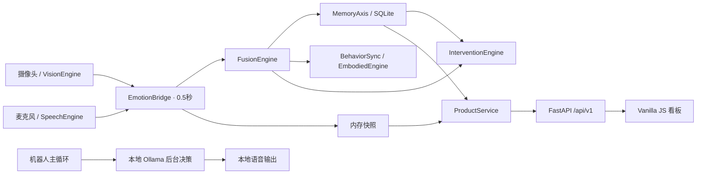

# 小予 · SoulCompanion AI

更新：2026-10-03。

SoulCompanion V2 正在按编号分支开发 Web、手机 Web、微信小程序与 Android 客户端。已保留的本地产品在 `01-product-baseline`；`02-cross-platform-ui` 提供 Taro 五页界面与设计系统，`03-device-media-capture` 增加用户主动开启的本地摄像头预览、麦克风采样及资源释放。DEMO_ONLY Preview 也允许主动测试本地设备，当前音视频不上传，尚未接入情绪分析后端。运行步骤见 [V2 客户端](apps/client/README.md)，本阶段验证与平台限制见 [Phase 03](docs/v2/03-device-media-capture.md) 和 [媒体隐私](docs/v2/MEDIA_PRIVACY.md)。

面向 ASD 儿童情绪陪伴场景的本地多模态软件。交付范围是**单台电脑、单名本地管理员、单儿童档案**：实时看板、历史记录、家长报告、组件状态、隐私设置和数据维护。核心情绪融合与行为规则保留原有实现。

这是陪伴与研究辅助软件，情绪推断和报告分数不提供临床诊断或疗效判断。真实设备、模型及执行器需要另行实机验收。

## Architecture / 架构



一个进程内共享设备状态，使用一个 Web worker。实时快照不查询历史数据库或调用模型；页面每秒读取一次快照，系统状态约 7 秒、历史与趋势至少 30 秒、报告至少 60 秒或手动刷新。数据库操作独立关闭连接。

原始架构、风险分级和设计取舍见 [PRODUCT_AUDIT](docs/PRODUCT_AUDIT.md)。接口文档启动后访问 `/docs`；正式接口采用具名 Pydantic 模型与统一错误、请求编号。

## Quick Start / 快速启动

已验证环境：Windows、Python **3.12**。Web 模式只需要轻量依赖，不下载感知模型，也不需要摄像头。

```powershell
git clone https://github.com/C1801SYQ/SoulCompanion-AI.git
cd SoulCompanion-AI
python -m venv .venv
.\.venv\Scripts\python.exe -m pip install -r requirements-web.txt
.\.venv\Scripts\python.exe -m web.app
```

打开 http://127.0.0.1:8000 。Linux 可将上述解释器替换成 `.venv/bin/python`。

页面会显示 `REAL` 与实际 SQLite 历史；未连接设备时明确显示“暂无感知数据”、风险未知和组件降级。空数据库的报告没有健康分数。`/healthz` 检查存活；`/readyz` 返回正常、明确降级原因或不可用（503）。

本地产品基线已提交并推送到 `01-product-baseline`，尚未合并 `master`。克隆后检出该分支可取得保留的交付版本；开发新客户端请使用对应编号分支。基线已用干净源码副本与新虚拟环境验证安装流程。

## Real Mode / 真实模式

```powershell
# 只读取本地历史，不开启摄像头、麦克风或机器人
.\.venv\Scripts\python.exe launch.py --no-robot

# 安装感知依赖并准备下述模型、设备后，启动完整本地链路
.\.venv\Scripts\python.exe -m pip install -r requirements.txt
.\.venv\Scripts\python.exe launch.py
```

完整模式的摄像头、麦克风、Vosk、SER、ONNX、Ollama 和执行器状态分别检查。模型缺失或设备失败会显示原因。`--hardware` 是请求硬件的选项；本仓库提供的执行器仍为模拟器，不能据此声称实体机器人已连接。按 Ctrl+C 关闭并释放资源。

## Demo Mode / 显式演示

完全不采集、不访问真实历史数据库的本地演示：

```powershell
$env:SOULCOMPANION_DEMO_MODE='true'
.\.venv\Scripts\python.exe launch.py
```

恢复真实模式前在新终端启动，或设置 `$env:SOULCOMPANION_DEMO_MODE='false'`。DEMO 后端禁用真实历史及旧数据接口。

页面也提供 `DEMO · 合成演示` 按钮及 `?demo=1`。它们只改变浏览器显示，不停止另一个正在运行的真实采集进程。所有演示内容与导出都标注 `DEMO DATA`。网络错误不会自动切换演示，断线显示 `Backend disconnected · OFFLINE`，无效响应显示 `ERROR`。

静态演示不包含真实数据，不连接 API：

```powershell
.\.venv\Scripts\python.exe scripts/build_site.py --out .test-artifacts/site
.\.venv\Scripts\python.exe -m http.server 8080 --bind 127.0.0.1 --directory .test-artifacts/site
```

静态站始终 DEMO，真实模式按钮禁用，包括 `?nodemo=1`。构建器拒绝覆盖未标记的非空目录。Cloudflare 只能托管此合成静态产物，见 [静态发布说明](docs/Cloudflare部署指南.md)。`streamlit_dashboard.py` 是独立旧合成演示；正式入口使用 FastAPI 看板。

## Environment Variables / 配置

[.env.example](.env.example) 是参考模板，**不会自动加载**。在启动终端设置环境变量；CLI 的 `--host`、`--port` 优先于默认配置。非法配置给出变量名和要求。

| 变量 | 默认值与用途 |
| --- | --- |
| `SOULCOMPANION_APP_ENV` | `production`；可选 development/test/production |
| `SOULCOMPANION_DEMO_MODE` | false；true 禁用真实采集与历史访问 |
| `SOULCOMPANION_DB` | 项目 `data/emotional_db.sqlite`；可设持久化绝对路径 |
| `SOULCOMPANION_DASHBOARD_HOST` | 127.0.0.1；仅允许 localhost/回环 IP |
| `SOULCOMPANION_DASHBOARD_PORT` | 8000；1–65535 |
| `SOULCOMPANION_CORS_ORIGINS` | 本机 8000 来源；禁止远程和通配来源 |
| `SOULCOMPANION_LOG_LEVEL` | INFO；DEBUG/INFO/WARNING/ERROR/CRITICAL |
| `SOULCOMPANION_RATE_LIMIT` | 每分钟 180 次 API 请求，30–10000；所有本机标签页共享 |
| `SOULCOMPANION_RETENTION_DAYS` | 0 永久保留；1–3650 是手动维护策略，不自动删除 |
| `OLLAMA_URL` | http://localhost:11434/api/generate；仅允许本地地址，无代理或重定向 |
| `OLLAMA_MODEL` | gemma3n:e4b；须与本机已安装标签一致 |
| `OLLAMA_TIMEOUT` | 每次请求总时限 60 秒，1–120；包含连接、响应头和正文，最多重试一次 |
| `SOULCOMPANION_VISION_MODEL` | models/onnx_model.onnx |
| `SOULCOMPANION_HAAR_PATH` | models/haarcascade_frontalface_default.xml |
| `SOULCOMPANION_VOSK_PATH` | model |
| `SOULCOMPANION_SER_PATH` | models/ser_model |

模型相对路径按仓库根目录解释。`SOULCOMPANION_API_KEY` 是未使用的旧保留字段，不提供身份认证。

## Models / 模型

完整感知模式需自行提供许可合适且与适配器输入、标签对应的模型：ONNX 情绪模型、Haar 人脸分类器、Vosk 离线模型和本地 Hugging Face SER 模型及特征提取器。模型目录不由软件验收脚本下载。SER 加载明确使用 `local_files_only=True`。

Ollama 由管理员单独安装与启动；`ollama list` 检查模型标签，配置 `OLLAMA_MODEL` 为实际存在的标签。状态探针仅检查本地服务和模型列表。生成失败、超时、非 200、无效 JSON 或空结果使用确定性温和回复；连接或超时最多重试一次，总等待最多约两倍请求时限。正文上限 64KiB，停止时取消当前 socket。

轻量 Web 的锁定依赖见 `requirements-web.txt` 和 `constraints-web.txt`；可选大型感知依赖在 `requirements.txt`，其全部平台/模型组合尚未安装验收。

## Hardware / 设备验收

```powershell
# 默认仅 Fake 软件接口测试；结果明确 verified_hardware=false
.\.venv\Scripts\python.exe scripts/hardware_smoke_test.py

# 准备设备依赖后进行真实探测；不会自动下载模型
.\.venv\Scripts\python.exe scripts/hardware_smoke_test.py --real
```

真实探测可能占用摄像头和麦克风。失败状态与检查原因需要逐项处理；软件 Fake 通过不能替代实机验收。本轮未验证实际儿童会话或实体执行器。

## Development / 开发

保留 Vanilla JS、同源 REST 与 SQLite；不加入空的认证、多租户字段或未使用迁移依赖。正式 API 位于 `web/product.py`，应用服务位于 `web/service.py`，契约位于 `web/contracts.py`；旧 GET API 暂时保留同样本机边界。部署请固定为单 worker。

历史记录分页范围为 1/7/30 天，每页 1–500 条；看板每页 20 条。风险状态来自快照，与所选报告日期独立。报告分数是研究规则输出；空数据为 null。

## Testing / 测试

Python 3.12、Node.js 24 用于软件检查；CI 不下载感知模型。

```powershell
.\.venv\Scripts\python.exe -m pip install -r requirements-web.txt -r requirements-dev.txt
New-Item -ItemType Directory -Force .test-artifacts
.\.venv\Scripts\python.exe -m pytest -q -p no:cacheprovider --basetemp .test-artifacts/pytest-local
.\.venv\Scripts\python.exe -m ruff check config.py launch.py main.py core emotion modules hardware reports utils web scripts tests
.\.venv\Scripts\python.exe scripts/acceptance_smoke.py
npm ci --ignore-scripts
npm test
npm run test:demo
npm run build
npm run lint
npx playwright install chromium
$env:SOULCOMPANION_PYTHON=(Resolve-Path .\.venv\Scripts\python.exe).Path
npm run test:e2e
```

重复 pytest 时使用新的 `--basetemp` 路径；Windows 上旧缓存权限可能影响重复运行。浏览器结果与截图位于 `.test-artifacts/browser-acceptance`。验收脚本使用明确标注的合成记录写入真实临时 SQLite 并请求真实 HTTP 后端，测试分页、报告和重启持久化；它们不会操作默认真实数据库。

依赖检查：`python -m pip_audit --disable-pip --no-deps -r constraints-web.txt` 和 `npm audit --audit-level=high`。前者检查轻量运行时全部锁定依赖，未包含可选大型感知依赖。

## Production / 生产运行与部署

采用经过验证的 Windows 原生轻量 Web 部署，完整 Edge 也在原生进程运行。安装、持久化、备份和可选 Linux Docker 配方见 [DEPLOY.md](DEPLOY.md)。本机没有 Docker，本轮不声称镜像已经构建或运行。

GitHub Actions 定义 backend-tests、frontend-build、frontend-tests、lint、dependency-checks；远程结果需要提交后由 GitHub 实际执行，本轮没有推送，不能宣称远程全绿。

## Security / 安全边界

本版本明确采用 **Local-only Product**。本机登录用户是管理员；没有远程家长账户、登录会话或多租户授权。应用拒绝非回环绑定、远程客户端、非法 Host、跨站 Origin 和转发头；CORS 仅控制浏览器来源。所有新版、旧版接口及 API 文档共享边界。

不得通过公网端口、隧道或反向代理分享真实看板。对外演示仅发布合成静态产物。未来远程版本须先实现成熟密码散列、HttpOnly 会话、注销、授权、CSRF、HTTPS 与数据归属迁移。

后端错误返回通用说明和 request_id；日志不记录原始儿童话语、提示词或模型回复。前端动态文本使用 `textContent`，不会将用户或 LLM 字符串作为 HTML 执行。旧 CloudSync 的远程 relay 明确禁用，`EMOTION_RELAY_URL` 配置会被拒绝。

## Privacy / 隐私与数据维护

真实模式可能在本机 SQLite 保存原始语音文本、上下文和推断。正式 v1 历史 API 与默认导出不包括原始文本；兼容旧历史接口仍可能返回原始文本，原因和报告也可能敏感。它们都受同一本机访问边界保护。数据目录、备份、导出、日志和截图应由管理员限制访问，不提交到 Git，不同步到公网目录。Windows 文件模式不等同于完整 ACL 或磁盘加密。

数据库有版本和事务迁移，保留旧数据及索引；更高版本拒绝写入。维护命令只操作现有数据库，输出文件必须不存在，父目录预先创建：

```powershell
.\.venv\Scripts\python.exe scripts/data_admin.py info
.\.venv\Scripts\python.exe scripts/data_admin.py backup --output data/before.sqlite
.\.venv\Scripts\python.exe scripts/data_admin.py export --output data/emotions.json
.\.venv\Scripts\python.exe scripts/data_admin.py export --output data/emotions.csv
# 显式包含原始话语：export --output data/raw.json --include-raw
# 清理30天前记录：先验证备份，再删除；需要明确确认
.\.venv\Scripts\python.exe scripts/data_admin.py retention --days 30 --backup data/before-retention.sqlite --confirm-delete
# 删除所有记录，仍然必须备份
.\.venv\Scripts\python.exe scripts/data_admin.py delete --backup data/before-delete.sqlite --confirm-delete
```

指定另一数据库：`python scripts/data_admin.py --db <绝对路径> info`。DEMO 模式拒绝真实库维护。备份完整包含原始文本；删除源记录并不会删除备份，也不承诺磁盘残余的法证级擦除。保留期限由管理员显式执行，不是后台定时任务。

## Known Limitations / 已知限制

- 无远程账户、多儿童或多租户；无公网真实数据产品入口。
- 实际摄像头、麦克风、ONNX/Vosk/SER 模型、Ollama 生成及实体执行器仍需目标机器验收。
- SQLite 适合单机规模；多个 worker 或多个采集进程不属于当前交付范围。
- 阻塞的第三方模型/音频调用只能在限定等待后报告停止超时；不能强制安全中断第三方驱动。Ollama HTTP 使用总时限和 socket 取消。
- 旧 Streamlit 机器人入口已停用，使用统一 FastAPI/launcher 生命周期；独立 Streamlit 合成示例不属于主要验收界面。
- Docker 与 GitHub Actions 远程运行尚未在本轮实际执行。

## Troubleshooting / 故障排查

| 现象 | 处理 |
| --- | --- |
| `REAL` 但没有情绪 | 检查设备页；Web-only 未连接 bridge 时是预期结果 |
| `/readyz` degraded | 查看每个组件 reason；缺设备或 Ollama 不应冒充 healthy |
| `Backend disconnected` | 启动本机后端，确认端口，然后点击重新连接；不会自动 Demo |
| `ERROR` | 检查通用错误与 request_id；无效响应、429 或契约错误均保留真实模式 |
| 429 | 多标签页共享限额；关闭多余页面并等待 Retry-After |
| 数据库不可用/503 | 核对配置路径、目录权限和版本；维护前使用备份，勿删 WAL 文件 |
| 非法 PORT/HOST | 按错误变量名修正；本版不允许 0.0.0.0 |
| 静态构建拒绝目标目录 | 选新的空目录，或此前由构建器标记的目录；不删除已有用户文件 |
| 模型缺失/损坏 | 配置本地兼容模型；查看组件状态，勿用默认中性情绪掩盖失败 |

## 版权与许可

本项目及源代码、文档、设计、模型和数据结构的知识产权归 **予怀团队** 所有，最终解释权归予怀团队。仅供学术研究、教育及团队内部使用；未经书面授权不得商业使用、二次分发或售卖。合作和授权请联系予怀团队。

本项目为辅助工具，不能替代专业诊断或治疗；原有许可与免责声明不因本轮工程改动改变。

© 予怀团队 · SoulCompanion AI
