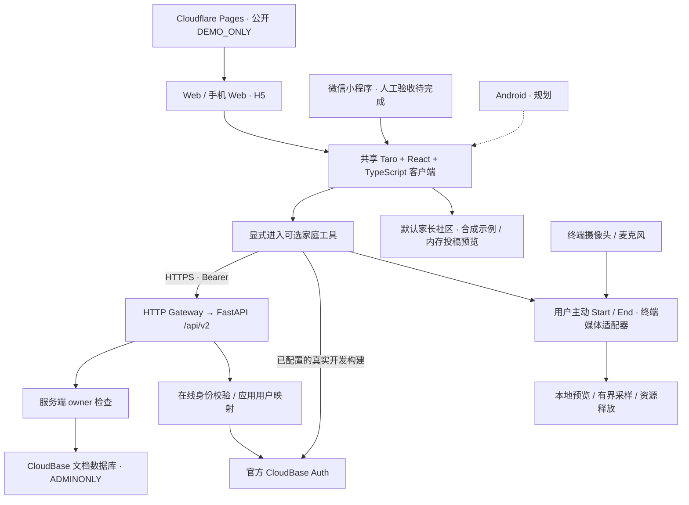
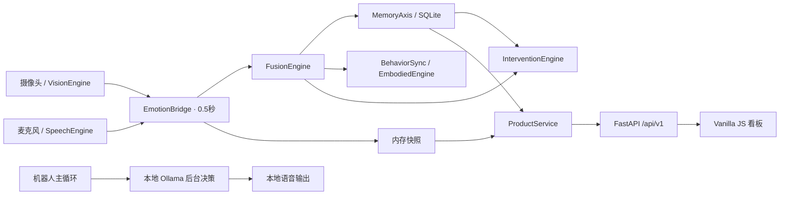

# 予怀 · SoulCompanion AI

更新：2026-10-10。当前开发分支：`pc-02-family-identity`；开发成果尚未合并到 `master`。

予怀面向 **0～18 岁儿童家庭**，由成年家长和监护人使用，帮助交流育儿经验、理解孩子与改善亲子沟通。微信小程序是优先平台，H5 用于共享界面、开发预览与浏览器测试。默认首页为家长社区，浏览不要求诊断标签、购买机器人、订阅或先建儿童档案。

**PC01 是可操作的社区产品原型：列表和详情均为明确标注的合成示例，投稿仅内存预览，不会发布到社区。真实社区发布、互动和内容审核尚未实现。** 育儿知识与手动成长记录展示尚未接入的空状态；旧陪伴、洞察和情绪报告作为可选家庭工具保留。

Phase 01～04 的共享客户端、终端媒体采集及 CloudBase 云后端成果继续沿用。Phase 04 已完成实际部署、API 和 H5 官方 SDK 验收，云端保存账户、私有儿童档案及会话元数据；PC01 没有新增云资源。**V2 媒体上传、AI 推理和 Android APK 尚未实现，实体机器人暂停。**

PC02 增加微信导航/键盘兼容、独立家长社区昵称及可选私有儿童年龄段。**限定云增量已获授权，修复后的函数代码和 version2 marker 已生效；429 项后端回归、15项真实 CloudBase API及额外官方 H5 SDK完整组合验收通过。** 首次认证门槛失败和成功回滚保留在报告中。兼容性构建已获用户确认 DevTools 编译与页面切换正常，最终身份构建、真实微信登录和手机仍需人工验证；真实 API/H5通过不等于微信真机通过。当前状态见 [PC02 报告](docs/parent-community/PC02_DELIVERY_REPORT.md)、[人工清单](docs/parent-community/WECHAT_MANUAL_CHECKLIST.md) 和 [云变更计划](docs/parent-community/PC02_CLOUD_CHANGE_PLAN.md)。

本项目不提供临床诊断或疗效判断，也不把商业计划中的技术、专家合作和财务陈述当作已实现能力。[PC01 报告](docs/parent-community/PC01_DELIVERY_REPORT.md) 和 [Phase 04 报告](docs/v2/PHASE04_DELIVERY_REPORT.md) 保留各阶段的历史证据。

## 平台与技术栈

| 平台 / 层 | 当前实现 | 验证范围 |
| --- | --- | --- |
| Web / 桌面浏览器 | Taro 4 + React 18 + TypeScript，四个家长入口与保留的家庭工具 | PC01 验证结果见交付报告；历史真实云端 H5 验收保留 |
| 手机 Web | 同一 H5 客户端，移动底部导航与触控布局 | 浏览器移动视口回归通过；不代表所有手机浏览器和实体设备均已验收 |
| 微信小程序 | 共享 Taro 页面、媒体适配器和官方 CloudBase 微信登录适配器 | PC02 含 SDK 的构建及官方 WXSS 编译通过；兼容性构建 DevTools 用户确认，最终身份/登录/真机仍待人工验证 |
| Android | 规划复用客户端与 Web 媒体适配器 | 尚无 APK、原生封装或 Android 实机验收 |
| 静态托管 | Cloudflare Pages 托管 H5 | 公开页面保持 `DEMO_ONLY`，不接入真实云端账户或数据 |
| 云后端 | CloudBase HTTP 云函数 + 独立 FastAPI `/api/v2` | Phase04 成果保留；PC02 修复代码与 version2 marker 已生效，15 项真实 API 验收通过 |
| 认证与存储 | 官方 CloudBase Auth SDK + CloudBase 文档数据库 | PC02 双账户API15项及额外完整API11项/H5 SDK12项通过；微信账户与手机待人工执行 |

客户端位于 [apps/client](apps/client/)，云 API 位于 [cloud/api](cloud/api/)。社区、育儿知识、成长记录、我的共用现有设计系统；Home、Session、Insights、Reports、Settings 保留原路径。V1 本机看板、SQLite、研究模型和机器人代码继续保留，见下方 Legacy 小节。

## V2 当前架构



图中云端路径用于显式进入家庭工具的真实开发构建。社区等公共页面暂停私有读取，不申请摄像头/麦克风、不读儿童档案/报告、不调用社区写入 API。公开 Cloudflare DEMO 构建不初始化云认证、不请求私有数据。本地媒体只用于预览和采样，没有上传或推理链路。

### 云端身份、数据库与数据隔离

- Web 使用官方 CloudBase 用户名/密码登录；微信适配器使用官方微信身份流程。FastAPI 对每个私有请求进行在线 token 校验，不自行存储密码或签发 JWT，也不相信客户端提交的 UID/OpenID。
- 已验证主体映射为应用用户 UUID；所有私有档案和会话操作使用服务端推导的 owner。跨用户与不存在资源统一返回 404，匿名私有访问返回 401。
- Phase04 的七个集合和十三个项目索引保持不变；PC02 授权后新增一个 ADMINONLY 家长社区资料集合及一个唯一 owner 索引，独立 marker 当前为 version2。客户端不能绕过 API 直查数据库，真实 token 的直接访问拒绝已验证。
- 令牌只保存在客户端内存，刷新后重新登录。退出、账户切换和 401 会清除私有界面与过期响应。服务端 key 仅放在忽略的部署配置和云函数托管环境变量中。
- 精确 CORS、请求大小/超时限制、应用及网关限流保护开发 API。现有开发环境是有限期限和配额的 CloudBase 体验版，**不是永久免费或无限资源**；Phase 04 验收时超额付费和自动续费均关闭。

数据库选择与权限边界见 [DATABASE_DECISION](docs/v2/DATABASE_DECISION.md)、[CLOUD_PRIVACY](docs/v2/CLOUD_PRIVACY.md) 和 [schema 声明](cloud/schema/001_metadata.json)。[云架构设计记录](docs/v2/CLOUD_ARCHITECTURE.md) 保留早期设计状态，当前完成情况以交付报告为准。

### 终端摄像头与麦克风

用户主动 Start 后才请求权限，提供本地视频预览、有界图像/音频采样和麦克风强度；页面加载和导航不会自动启用设备。End、离开页面、后台切换或错误会停止采集并释放资源，返回页面不会自动重启。

本地 Stop 先完成，再异步结束云端会话元数据，不等待网络。原始视频、图像、音频、PCM、设备 ID/label 不进入云 API，也不将采样冒充情绪、转录或 AI 回复。公开 DEMO 页面仍允许用户主动体验本地设备。详细边界见 [媒体隐私](docs/v2/MEDIA_PRIVACY.md)。

## 当前功能与阶段进度

已完成：

- 四个主入口、六个年龄段与七类话题组合筛选、示例帖子详情、返回状态恢复和纯文本投稿预览；示例内容始终明确标注。
- 米黄/柔灰的共享界面、桌面/移动导航和可访问控件；育儿知识、手动成长记录保持真实的未接入说明。
- PC02 支持主动保存独立公开昵称、可选儿童年龄、身份切换同步隐藏草稿和能力探测；云端昵称及年龄读写、两账户所有权与清理通过真实 API 验收，界面以实际读回确认保存。
- 保留五个旧家庭工具、减少动态效果设置、DEMO 与错误/离线状态；公共路由暂停私有请求，账户切换继续清理私有数据和内存草稿。
- 用户主动开启的本地摄像头/麦克风会话、预览/采样及生命周期清理。
- CloudBase Web 登录/退出、用户昵称、儿童档案新增/修改/选择/归档。
- 云会话元数据创建、读取、列表和幂等结束；用户数据隔离与匿名拒绝。
- 独立 FastAPI V2 API 的实际 CloudBase 部署，以及真实 API/H5 自动验收。

当前未实现或未验证：

- **未实现：真实社区发布/审核/互动、来源核对的知识文章、手动成长记录存储、V2 媒体上传、AI 推理与 Android APK。** 情绪记录和报告接口只读，真实空数据不会生成结论。
- **待人工验证：最终身份构建的微信 DevTools、手机微信登录、权限与实体设备行为。** 已确认的兼容性编译、构建成功和浏览器虚拟设备测试不能替代真机验证。
- 尚未发布真实云账户的公开生产客户端，未迁移本地 SQLite 数据，未合并 `master`。

| 阶段 | 已记录主题 / 分支 | 当前进度 |
| --- | --- | --- |
| Phase 01 | `01-product-baseline` · 本地产品基线 | 已完成并保留 |
| Phase 02 | `02-cross-platform-ui` · 跨平台界面与设计系统 | 开发、构建与软件验收完成 |
| Phase 03 | `03-device-media-capture` · 终端媒体采集 | 开发与浏览器自动验收完成；实体设备验收仍有平台限制 |
| Phase 04 | `04-cloud-backend` · 云后端 | 实际部署、API/H5 自动验收完成；微信人工验证待完成 |
| Phase 05 | `05-realtime-emotion-pipeline` · 实时情绪链路 | 规划，未开始 |
| Phase 06 | `06-algorithm-modernization` · 算法现代化 | 规划，未开始 |
| Phase 07 | `07-wechat-miniapp` · 微信小程序完整平台验收 | 规划，未开始 |
| Phase 08 | `08-android-apk` · Android APK | 规划，未开始 |
| Phase 09 | `09-cloud-release` · 云端发布 | 规划，未开始 |
| Phase 10 | `10-release-candidate` · 候选发布版本 | 规划，未开始 |

上述 Phase 编号来自 [Phase 01 记录](docs/v2/01-product-baseline.md)，Phase 05～10 是历史规划，均未开始；当前产品优先级采用下面的家长社区路线。本轮范围为 PC02，不启动 PC03。

| 社区路线 | 主题 | 状态 |
| --- | --- | --- |
| PC01 | 家长社区产品重定位与可视原型 | 已交付并保留；真实发布与审核未实现 |
| PC02 | 微信身份与家庭资料 | 软件自动测试、15 项真实 API 与额外 API 11 项/H5 SDK 12 项通过，最终软件提交自身 9 项 CI 全通过；最终身份构建 DevTools/微信/真机待人工验收 |
| PC03 | 社区数据库与审核后端 | 规划 |
| PC04 | 真实社区与运营闭环 | 规划 |
| PC05 | 育儿知识与私有成长记录 | 规划 |
| PC06 | 真机与受控体验版交付 | 规划 |

完整边界见 [路线](docs/parent-community/00-roadmap.md) 与 [产品规格](docs/parent-community/01-product-spec.md)。

## 快速启动

建议使用 Node.js **24**、Python **3.12**。CloudBase 云函数运行时为 Python **3.11**；云 API 支持 Python 3.11 及以上。V2 客户端开发和轻量测试不需要下载感知模型或启动机器人。

### 1. 获取当前开发分支并安装依赖

```powershell
git clone --branch pc-02-family-identity https://github.com/C1801SYQ/SoulCompanion-AI.git
cd SoulCompanion-AI
python -m venv .venv
& ./.venv/Scripts/python.exe -m pip install -r requirements-web.txt -r requirements-dev.txt -r cloud/api/requirements-cloud.txt
npm ci --ignore-scripts
npm --prefix apps/client ci --ignore-scripts
```

Linux/macOS 将示例中的 `.venv/Scripts/python.exe` 换为 `.venv/bin/python`，并使用对应 shell 的环境变量语法。已有仓库应先检查工作区再切换分支，不覆盖未提交工作。

### 2. 本地 DEMO 与设备预览

```powershell
$env:PUBLIC_DEMO_ONLY = 'true'
npm --prefix apps/client run dev:h5
```

打开 [本地 H5 社区](http://127.0.0.1:5173/)。默认可浏览合成帖子、年龄/话题筛选、详情和投稿预览，无需登录。通过“成长记录”进入旧家庭工具后，情绪/报告为 DEMO 合成数据，设备仍需用户主动 Start。浏览器与系统控制实际设备权限。

### 3. 真实 CloudBase 元数据开发预览

在同一仓库根目录的新终端中，使用已验证的公开开发配置：

```powershell
$env:PUBLIC_CLOUDBASE_ENV_ID = 'soulcompanion-dev-d0dzo6f2a24211'
$env:PUBLIC_CLOUDBASE_REGION = 'ap-shanghai'
$env:PUBLIC_WECHAT_APP_ID = 'wx11a055ed4dc69764'
$env:PUBLIC_API_BASE_URL = 'https://soulcompanion-dev-d0dzo6f2a24211-1501181209.ap-shanghai.app.tcloudbase.com'
$env:PUBLIC_DEMO_ONLY = 'false'
Remove-Item Env:CF_PAGES -ErrorAction SilentlyContinue
npm run client:build:h5
& ./.venv/Scripts/python.exe -m http.server 18404 --bind 127.0.0.1 --directory apps/client/dist
```

打开 [本地开发预览](http://127.0.0.1:18404/)，社区仍只展示合成示例。通过“我的”显式进入账户与私有档案后，使用自己有权限的 CloudBase 账户登录；只有家庭工具连接既有开发环境。情绪/报告空状态不会启动 AI 推理。

`PUBLIC_API_BASE_URL` 是 HTTPS **origin，不带 `/api/v2`**；客户端自行附加 V2 路径。目前云端 CORS 精确允许 `http://127.0.0.1:18404`，不能把 5173、localhost 或新的公开域名当作同一个 origin。更改允许来源须按部署文档处理；以上清除 `CF_PAGES` 仅影响当前终端，不修改公开站点。

### 4. 微信小程序构建

保留上一节的公开配置，停止占用终端的本地预览服务器后执行：

```powershell
npm run client:build:weapp
```

输出为 `apps/client/dist-weapp`。使用有 AppID 权限的账号导入微信开发者工具；当前最终构建、微信登录与真机步骤见 [PC02 人工清单](docs/parent-community/WECHAT_MANUAL_CHECKLIST.md)，合法 request 域名等历史配置见 [MANUAL_ACTIONS](docs/v2/MANUAL_ACTIONS.md)。昵称和可选儿童年龄的真实 API 已通过，微信界面保存仍须按清单人工验收。Android 目前只有规划，没有 APK 构建命令。

## 开发配置

[.env.example](.env.example) 是配置参考；以下变量应在相应启动/构建终端或托管环境中显式配置。模板同时包含 Legacy V1 与 Phase 04 字段，两者独立。

| 变量 | 作用 / 边界 |
| --- | --- |
| `PUBLIC_API_BASE_URL` | V2 云端 HTTPS origin；为空时云功能关闭，不填密码或 key |
| `PUBLIC_CLOUDBASE_ENV_ID` / `PUBLIC_CLOUDBASE_REGION` | 前端公开环境 ID / 地域 |
| `PUBLIC_WECHAT_APP_ID` | 小程序公开 AppID，不是 AppSecret |
| `PUBLIC_DEMO_ONLY` | true 表示合成展示且禁用云账户；不禁止用户主动本地采集 |
| `CF_PAGES` | Pages 构建标识为 1 时强制 DEMO_ONLY，即使上一变量为 false |
| `PUBLIC_API_URL` | 独立的 Legacy V1 情绪 API 配置；不要与 V2 base 混用 |
| `CLOUD_ALLOWED_ORIGINS` | 云函数精确 CORS 来源，当前验收为本机 18404 origin |
| `CLOUDBASE_ENV_ID` / `CLOUDBASE_APIKEY` | 服务端配置；key 只放忽略的本地部署文件或云函数托管环境，绝不进入前端 |

不要把密码、API Key、Token、Secret、登录文件、真实儿童记录或媒体写入源码、README、截图和公开产物。服务端 key 轮换与体验环境期限见人工操作文档；本 README 不包含任何凭据。

## 测试与验证

以下为本地软件回归，认证/数据库测试使用受控测试实现；它们不替代真实 CloudBase、微信或实体设备证据。

```powershell
& ./.venv/Scripts/python.exe -m pytest -q -p no:cacheprovider --basetemp .test-artifacts/pytest-readme
& ./.venv/Scripts/python.exe -m ruff check config.py launch.py main.py core emotion modules hardware reports utils web cloud scripts tests
npm run client:typecheck
npm run client:test
npm run client:audit
npm test
npm run test:demo
npm run lint

# 为隔离的浏览器回归构建真实模式客户端，清除此前的 DEMO/云端构建选项
$env:PUBLIC_DEMO_ONLY = 'false'
$env:PUBLIC_API_BASE_URL = ''
$env:PUBLIC_API_URL = ''
Remove-Item Env:CF_PAGES -ErrorAction SilentlyContinue
npm run client:build:h5
npx playwright install chromium
$env:SOULCOMPANION_PYTHON = (Resolve-Path ./.venv/Scripts/python.exe).Path
npm run client:test:e2e
npm run client:test:media
npm run client:test:community
npm run client:build:weapp
git diff --check
```

重复 pytest 可选择新的 `--basetemp` 路径，避免 Windows 旧缓存权限问题。浏览器脚本使用独立、明确标注的合成 SQLite 记录与 Chromium 虚拟设备，不操作默认真实数据库或开发者物理摄像头。

仅检查云 API 与工具：`python -m pytest tests/cloud tests/cloud_tools -q`（使用上面安装依赖的解释器）。真实云端验收是另行授权的显式操作，会重置两个已有合成测试账户的密码并写入合成元数据；先阅读部署文档，默认计划模式不调用云端，不把它放入普通无凭据 CI。

社区脚本独立验证交互、响应式布局、网络/存储/设备边界，证据位于忽略的 `.test-artifacts/community-acceptance/`；微信构建成功不等于真机通过。PC01 当前数量与结果见交付报告。

历史 Phase 04 验证包括 Python **513** 项、客户端 **241** 项、三次 H5 E2E、14 组 media、真实 API **11** 项和 SDK 浏览器 **12** 项；当时九项 CI 均通过，见 [历史 CI](https://github.com/C1801SYQ/SoulCompanion-AI/actions/runs/37745126455)。依赖审计策略通过不等于没有漏洞，继承风险保留。

## 部署与文档入口

Cloudflare Pages 只负责静态 H5，不能运行 Python/FastAPI。当前 V2 Preview 使用根目录 `apps/client`、构建命令 `npm ci --ignore-scripts && npm run build:h5`、输出 `dist`、Node.js 24，保留 `PUBLIC_DEMO_ONLY=true`。当前公开站点不切换至真实云 API，也不改变其生产分支配置。

FastAPI V2 已部署为既有 CloudBase 环境中的 `sc-v2-api` HTTP 云函数，默认 HTTPS 网关 `/` 透传 `/api/v2`；文档数据库继续使用现有实例。体验版具有期限和资源额度，后续成本与续用须由所有者确认；不自动购买、升级、开启超额付费或自动续费。

| 文档 | 用途 |
| --- | --- |
| [PC01 基线审计](docs/parent-community/PC01_BASELINE_AUDIT.md) | Git、前端、导航、认证、媒体与测试基线 |
| [家长社区路线](docs/parent-community/00-roadmap.md) / [产品规格](docs/parent-community/01-product-spec.md) | PC01～06 与当前产品/数据边界 |
| [PC01 交付报告](docs/parent-community/PC01_DELIVERY_REPORT.md) | 原型、自动测试、平台限制及提交回执 |
| [PC02 交付报告](docs/parent-community/PC02_DELIVERY_REPORT.md) / [限定云变更](docs/parent-community/PC02_CLOUD_CHANGE_PLAN.md) | 微信身份与家庭资料、真实云执行/回滚、最终验收状态 |
| [PC02 schema](scripts/cloud_family_schema.py) / [代码部署与回滚](scripts/cloud_family_deploy.py) / [真实验收](scripts/cloud_family_acceptance.py) | 默认离线计划；apply 需核对既有授权范围和显式执行门槛 |
| [Phase 04 交付报告](docs/v2/PHASE04_DELIVERY_REPORT.md) | 31 项结果、端点、真实证据、用量与限制 |
| [CloudBase 部署](docs/v2/CLOUDBASE_DEPLOY.md) | 审计、schema、打包、受控部署和真实验收 |
| [微信人工操作](docs/v2/MANUAL_ACTIONS.md) | DevTools/真机、合法域名、key 轮换 |
| [云端隐私](docs/v2/CLOUD_PRIVACY.md) / [媒体隐私](docs/v2/MEDIA_PRIVACY.md) | 用户隔离与终端采集边界 |
| [Phase 01](docs/v2/01-product-baseline.md) / [Phase 02](docs/v2/02-cross-platform-ui.md) / [Phase 03](docs/v2/03-device-media-capture.md) | 保留基线、UI 和媒体阶段记录 |
| [客户端说明](apps/client/README.md) | PC01 入口、运行配置、测试与保留的家庭工具 |
| [Legacy 部署](DEPLOY.md) / [旧 Cloudflare 静态演示](docs/Cloudflare部署指南.md) | V1 单机产品与旧合成站的历史运行方案 |

## Legacy / Research Prototype

旧研究原型与 Phase 01 本机产品仍保留。`web/` 的 Vanilla JS 看板和 FastAPI `/api/v1`、本地 SQLite、`core/`、`emotion/`、`modules/`、`hardware/`、`launch.py`、Ollama/TTS 与机器人循环不作为 V2 云主架构，也不证明 V2 云推理或实体机器人已经交付。

### 原本地研究架构



Legacy 交付范围为单台电脑、单名本地管理员、单儿童档案、单 Web worker。V1 的本机安全边界和 SQLite 保持独立，不允许通过公网端口、隧道或反向代理分享真实 V1 看板；云端没有迁移该数据库。

### 保留的本机入口

```powershell
# 轻量 V1 Web：不自动启用设备或下载模型
& ./.venv/Scripts/python.exe -m web.app

# 在另一个终端运行本机 launcher，不启用机器人
& ./.venv/Scripts/python.exe launch.py --no-robot

# 默认 Fake 硬件软件检查，不能作为真实设备通过证据
& ./.venv/Scripts/python.exe scripts/hardware_smoke_test.py
```

V1 Web 默认在 `http://127.0.0.1:8000`。完整研究链路另需 `requirements.txt`、兼容 ONNX/Haar/Vosk/SER 模型、Ollama 和目标机器设备；未连接设备时显示不可用/降级，不用假情绪掩盖失败。`--hardware` 不能证明实体执行器存在，当前执行器仍有模拟实现。

真实模式的 Legacy SQLite 可能含原始语音文本、上下文和推断；数据库、备份、导出和日志须留在受控本机，不能提交或同步到公开目录。`scripts/data_admin.py` 保留本地备份、导出与带备份/确认的数据维护功能，DEMO 模式拒绝真实库维护。

原审计、数据维护和部署取舍见 [PRODUCT_AUDIT](docs/PRODUCT_AUDIT.md)、[Phase 01](docs/v2/01-product-baseline.md) 与 [DEPLOY](DEPLOY.md)。旧 `streamlit_dashboard.py` 合成示例、感知模型和机器人研究代码没有因 README 更新而删除。

## 版权与许可

本项目及源代码、文档、设计、模型和数据结构的知识产权归 **予怀团队** 所有，最终解释权归予怀团队。仅供学术研究、教育及团队内部使用；未经书面授权不得商业使用、二次分发或售卖。合作和授权请联系予怀团队。

本项目为辅助工具，不能替代专业诊断或治疗；原有许可与免责声明不因本轮文档改动改变。

© 予怀团队 · SoulCompanion AI
